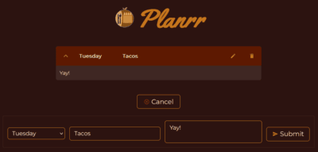
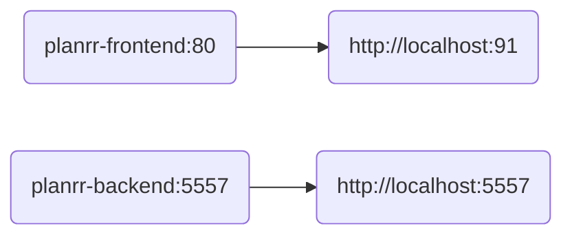

#  Planrr

> - Weekly meal planner

---


 <!-- markdownlint-disable-line MD013 -->


---

### 📷 Screenshot <!-- markdownlint-disable-line MD001 -->



---

### 🔀 Docker Compose Flow:



#### Building Images:

```bash
./build.sh
```

---

### 📄 Documentation

- [Frontend](./frontend/README.md "Frontend")
- [Backend](./backend/README.md "Backend")
