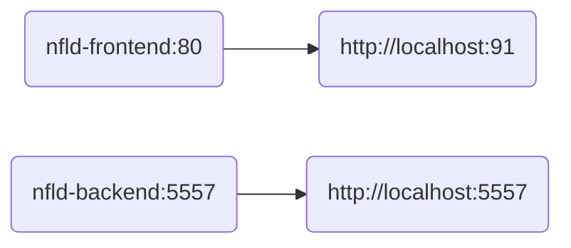

#  Planrr

> - Weekly meal planner

---

### Docker Compose Flow: <!-- markdownlint-disable-line MD001 -->



---

### To build all images:

```bash
./build.sh
```

---

### Additional documentation available:

- [Frontend](./backend/README.md "Frontend")
- [Backend](./frontend/README.md "Backend")
