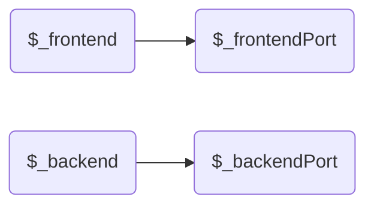

#  Planrr

> - Weekly meal planner

---

 &nbsp;


 &nbsp;
 &nbsp;
 &nbsp;
 &nbsp;
 &nbsp;
 &nbsp;
 &nbsp;


 &nbsp;
 &nbsp;
 &nbsp; <!-- markdownlint-disable-line MD013 -->


 &nbsp;


---

### 📷 Screenshot <!-- markdownlint-disable-line MD001 -->


---

### 🐳 Docker

#### Compose Flow:



#### Building Images:

```bash
./build.sh
```

---

### 📄 Documentation

#### Building:

```bash
./docs.sh
```

#### Links:

- [Frontend](./frontend/README.md "Frontend")
- [Backend](./backend/README.md "Backend")
